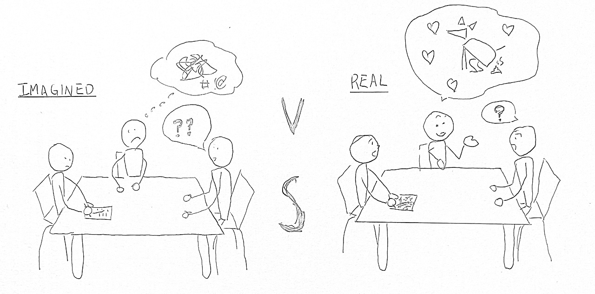

# On Collaborative Design: A Story About Dog Poop

*A sketch of the scene when I learned about dog poop in Needham. This is relevant as it is the central story of this piece. I drew this piece and ran it through an edge detection algorithm I wrote for QEA2 to clean up the edges.*

## What.

I've always thought I was a stellar interviewer. I mean, it can't be too hard, right?

I was quickly humbled. During my first engagements, I would get factual and lifeless recalls of a sequence of events rather than a reliving of their joys and pains. While we drew many insights, I didn't learn as much as I had hoped.

That was until I took notes for my teammate Jack's (fake name for privacy) interview. We were interviewing Millie (also fake name for privacy), a journalist in their mid-twenties. Vishnu is quiet but spectacular at getting people to talk about what matters to them. Whether he realized it or not, his follow-up questions were, while admittedly awkward, incredible at forcing the interviewee to relive and reveal specific stories. He would ask a question like "What is your favorite part about reporting," and the interviewee would give a generic story that mirrored the factuality of a news story. Then he would ask again, "What is your favorite reporting experience?"

To me, those are the same questions, and I also saw Millie a bit confused, as if she were thinking, *huh, were you listening? I just told you!*

Then, the awkward moment of silence was followed by a chuckle, Millie said,

*My favorite feature was about **dog poop**.*

My Sharpie came to a halt, and I looked up to make sure Millie wasn't joking. I remember thinking to myself: *dog what now?*

She then spent 10 minutes telling us about her time trailing forgotten dog poop on the ground, leading her to cover a major story about the park rangers and their efforts in removing biohazards from the park. She lamented how it became the most popular story on the Needham FaceBook forum and sparked a major change in the town. At that moment, I realized I had done all my interviews wrong.

## So What?

I pride myself on being able to strike up a conversation from anything. Although interviewing people uses similar skills, I missed a crucial aspect – the ability to be **awkward**. The silences, repetitive questions, and relentless drilling into uncomfortable topics are the keys to getting unique insights.

A few days after the Millie interview, I talked to Patrick (fake name for privacy). Interviewing Patrick was tough; he was almost paranoid, emphasizing that he did not want his political opinions leaked. Moreover, he used to be a high school Latin teacher – if there was someone good at handling prolonged awkward silences, that would be Patrick. However, I'm determined to get good insights and stories this time and am not leaving until I get them. After a few generic questions to warm up and get to know each other, I decided to ask my first "scary" and "awkward" question:

*Do you mind telling us about your job security? Do you feel like your job will survive the downward trend of journalism as an industry?*

Patrick looked at me, and for a split second, I felt like I had stepped on the toes of every local journalist in the 10-mile radius. He sighed,

*Yeah, I mean, it's a job for now. And I really like it, so I hope it doesn't stop being my job. You know, the office is only four people, and one of our colleagues died on the job a few months ago. He was old, and he was reporting a hunger strike when he got a stroke and passed away. It doesn't seem like they are planning on filling the vacancy, and I mean, he's really a bad-ass, **I wish I got to spend more time with him**.*

I took a deep breath. *Wow.* That was difficult, but it allowed me to take a deeper peek into Patrick's life as a journalist. We then centered on his feelings of disconnection from his peers. This eventually became one of our insight statements as we interviewed more journalists and honed into this feeling of loneliness.

There is no point in building a relationship with your interviewee if you only ask easy questions. The idea behind an engagement is to get to know your people group well enough to uncover thoughts and emotions that you could not find anywhere else. You MUST ask difficult and awkward questions to get insights and substance.

## Now what?

Interviews uncover stories; co-designs create them. In a co-design, silence isn't enough. I must introduce materials, prototypes, or prompts that **challenge assumptions and spark discussion**. For example, instead of asking journalists what they want in a product, I could present two incomplete ideas and ask what bothers them about these products and why.

Beyond interviewing, I've realized that silence isn't just helpful—it's necessary. I've always known that negative space strengthens an art piece, which is no different in real life. Leaving space for reflection is crucial, whether in design, work, or everyday interactions.

That said, not every conversation needs to be profound. This lesson applies to interviewing and learning environments, where pushing past surface-level answers is key. However, this does not apply to situations where the aim is to build relationships. These questions are tiring. We must find the right place, setting, and time to do it. For example, if Patrick was on the job and actively chasing a lead, I don't think he would have been open to discussing his feelings to this extent. This lesson matters in engagements, but outside of that, it's fine just to chat.
