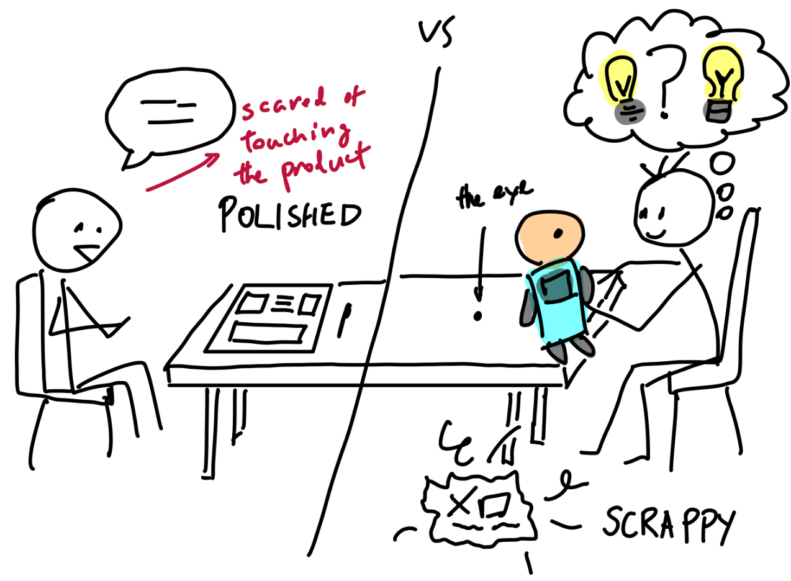

# Please Tear It Apart! A Commentary on Scrappy Prototypes

*A sketch of the polished prototype compared to the scrappy prototype, depicting the participant's body language and willingness to engage with the design.*

## What.

Earlier in the semester, my team decided to do four co-designs so we could focus on deeply analyzing each one. But things didn't go as planned. While we had engaging conversations, none of them felt like co-designs. Participants avoided interacting with our prototypes, offering far-fetched or only tangentially related feedback. We were stuck in an engineer's nightmare: the ideation phase.

In each session, getting the Sharpie into our participant's hands was a battle. They'd look at our clean, polished prototypes—a detailed DataViz interface, a mysterious Rolodex, a strange little transcription doll named Pumpkin Head—and react with amusement or confusion. Comments ranged from *"What if we gave interviewees Xanax so they told the truth?"* to *"Oh, someone else does the data analysis for me anyway."* When prompted to draw or modify the interfaces, most hesitated. The marker seemed scary—a commitment they weren't ready to make. I suspect they were scared of "dirtying" our prototypes, scared that we would go back disappointed that they had ruined something we spent a lot of time on.

Then came the final engagement.

When I opened the box, I was a bit embarrassed. It was raining that day, so we had crammed everything into our codesign box. The doll was falling apart, the paper interfaces were wrinkled and misaligned, and everything looked like it had been thrown together at the last minute. I took Pumpkin Head out, hurriedly putting its fallen eye back into its head, explaining that these are prototypes meant to be ideated on. While I expected some form of judgment from our interviewee for being unprepared, I quickly realized he did not care. Soon enough, he was doodling on our crinkled interfaces, meddling with the Pumpkin Head, and drawing all over our prototypes. He gave us ideas on what features to add, even allowing us to run a roleplay scenario where we designed his dream interface for a specific event.

For the first time, I saw genuine ownership. He wasn't just giving feedback—he was designing *with* us.

## So what?

After going home, I asked myself why this codesign worked. This is my hypothesis.

You need a **SCRAPPY** prototype to encourage codesign.

Yes, I know. That sentence made me (an engineer) cringe too. *What do you mean I can't CAD and stress-test it first?* However, co-design isn't about affirming the product or soothing a designer's ego. It's about building *with* people.

To do that, we must bring a "scrappy" and unfinished prototype, one that the average person would feel no guilt for destroying. However, that's not to say you can just set a timer and finish your prototype in 5 minutes – there must be some semblance of thought to it. For example, we used paper interfaces to test whether participants preferred apps or physical tools. That decision alone took more than 5 minutes of discussion. When we created our product, we also chose to use printer paper instead of other more durable material, as that signaled disposability, giving it that "single-use" feeling. **These low-fidelity designs encouraged iteration.** The result? Participants felt free to iterate. They wrote on sticky notes, moved pieces around, and fully engaged.

## Now what?

That said, this approach does have limitations. Co-design relies heavily on trust, pacing, and openness, which aren't always feasible in every design context. Some stakeholders might expect more polished materials to take the process seriously or may be constrained by time and unable to engage deeply with early-stage ideas – it's all about expectations and communication.

While the earlier phases focused on listening and iterating, in phase 3, we shift towards building a final product, relying more on personas than live participants. So, how do we co-design with people who aren't in the room?

I think it starts by treating personas as dynamic, not static. In the next phase, I'll push my team to revisit our insights regularly. We'll hold weekly sessions to examine our decisions through new lenses. I want us to keep asking, *Whose voice is this?* and *Are we designing for them or for us?*

I still don't have a perfect definition of co-design, but I know it requires humility, iteration, and a willingness to let go of polish. **Sometimes, the best thing you can do is bring in an idea vulnerable enough to be challenged. When participants feel safe tearing it apart—adding, changing, disagreeing—that's when co-design begins.**
